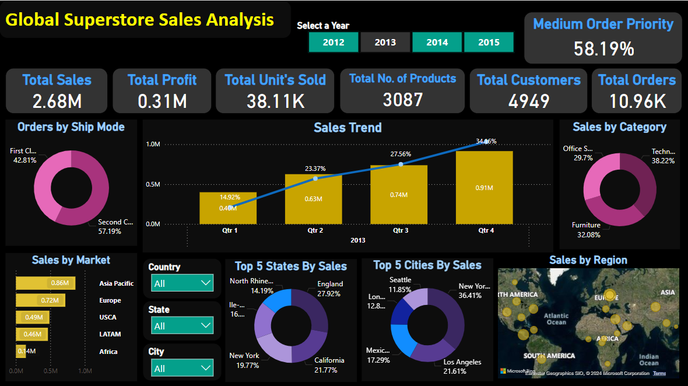

# Global Superstore Sales Analysis

## Overview
This report provides an in-depth analysis of sales performance at a global superstore using a detailed dataset and interactive dashboard. The analysis covers multiple aspects, including sales trends, product performance, customer demographics, and shipping modes across different regions and time periods.

## Key Metrics
- **Total Sales**: $2.68M
- **Total Profit**: $0.31M
- **Total Units Sold**: 38.11K
- **Total Number of Products**: 3,087
- **Total Customers**: 4,949
- **Total Orders**: 10.96K
- **Medium Order Priority**: 58.19%

## Dashboard Highlights
- **Sales Trend**: Visualizes quarterly sales growth, showing a steady increase with a notable peak in Q4.
- **Sales by Category**: Breaks down sales into three main categories:
  - Technology: 38.22%
  - Furniture: 32.08%
  - Office Supplies: 29.7%
- **Orders by Ship Mode**: Highlights that 57.19% of orders were shipped via Second Class, followed by 42.81% via First Class.
- **Sales by Market**: Visualizes sales distribution across different regions, with the highest sales in the Asia Pacific market ($0.86M).
- **Top 5 States & Cities by Sales**: Lists the top-performing states and cities, with New York and Los Angeles leading in their respective categories.
- **Sales by Region**: A world map that shows the distribution of sales across various regions, emphasizing the global reach of the superstore.

## Data Transformation and DAX Queries
- **Order Priority Transformation**: Converted priority levels into numeric values for more straightforward analysis.
- **Key Metrics Calculation**: DAX queries were used to calculate critical metrics such as total sales, profit, units sold, unique products, customers, and orders.

## Inferences and Insights
- **Quarterly Performance**: Consistent sales growth in Q4 across multiple years.
- **Regional Sales**: Europe and Asia Pacific are significant contributors to global sales.
- **Product Focus**: Technology products are the most profitable.
- **Shipping Preference**: Standard and Second Class are the most preferred shipping methods.
- **Order Priority**: Medium priority orders make up the majority of transactions.

## Interactive Features
- The dashboard includes slicers and filters for year, country, state, and city, allowing users to customize the analysis to their specific needs.
